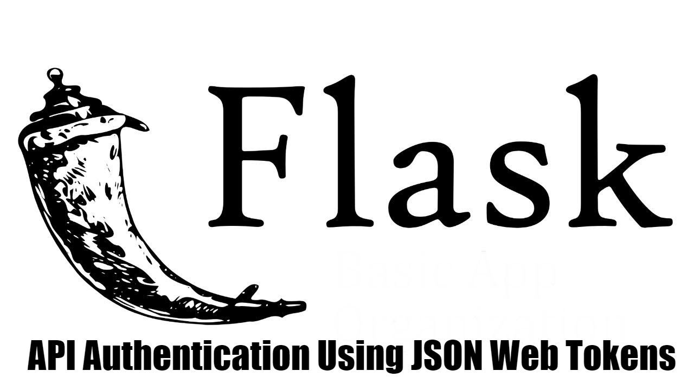

<h1 align="center">Welcome to Authentication Flask API JSON 👋</h1>



<p>
  
  <a href="On Test" target="_blank">
    
  </a>
  <a href="" target="_blank">
    
  </a>
</p>

</div>

<div>
Languages:

[Portuguese :brazil:](README-ptbr.md)

</div>
</div>


# About
> Thi is API Project for Flask, developed by [Pretty Printed](https://prettyprinted.com/), you can see the entire video [there](https://www.youtube.com/watch?v=J5bIPtEbS0Q&ab_channel=PrettyPrinted). On this project were made a API authentication using JSON web Token, showing how to protect routes.


## How to Use
If you want download this folder from this repository just follow this steps below:


1. Copy the url from your browser;
2. Replace the 'tree/main' or 'tree/master' with trunk;

Example: 
> https://github.com/User/somerepo/tree/main/folderyouwant
 
> https://github.com/User/somerepo/trunk/folderyouwant 

3.Go to the command Line and just grab the folder with SVN

```sh
    svn checkout https://github.com/User/somerepo/trunk/folderyouwant 
```

## How to Run
1. Install > virtualenv :


```sh
$ sudo apt-get install python3-venv
$ sudo yum install python3-venv
$ sudo zypper install python3-venv
```

2. Open a terminal in the project root directory and run:

```sh
$ python3 -m venv venv
```

3. Then run the command:

```sh
$ source venv/bin/activate
```

4. Then install the dependencies:

```sh
$ (env) pip install -r requirements.txt
```

5. Finally start the web server:
   
```sh
(env) export FLASK_APP=api.py
(env) flask run
```


## 🚀 Technologies
This Project was developed using the following technologies:


- Python
- Flask
- Insomnia / Postman


## Author

👤 **Alberto Junior**

* Github: [Alberto Júnior](https://github.com/wayfiding)
* LinkedIn: [Alberto Souza](https://linkedin.com/in/alberto-souza)
  
## 🤝 Contributing

Contributions, issues and feature requests are welcome!<br />Feel free to check [issues page](Teste). 

## 📝 License
Copyright © 2021 [Alberto Júnior](https://github.com/Wayfiding).<br />

Esse projeto está sob a licença MIT. Veja o arquivo [LICENSE](../LICENSE) para mais detalhes.

***
This README was generated with ❤️ by [readme-md-generator](https://github.com/kefranabg/readme-md-generator) and Alberto