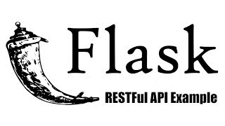

<h1 align="center">Bem Vindo ao Flask_RESTFul_API_JSON 👋</h1>



<p>
  
  <a href="On Test" target="_blank">
    
  </a>
  <a href="" target="_blank">
    
  </a>
</p>

</div>

<div>
Línguas:

[English :us:](README.md)

</div>
</div>

# About
> Este é um projeto Restful API para o Flask desenvolvido por [Pretty Printed](https://prettyprinted.com/), você pode ver o vídeo completo [aqui](https://www.youtube.com/watch?v=WxGBoY5iNXY&ab_channel=PrettyPrinted). Neste Projeto foi realizado uma API restful para autenticação usando  web token JSON e rotas para CRUD numa Tarefa chamada ToDo.

### **Pre-requisitos**
Para poder utilizar as tecnologias providas aqui, você necessitará de um editor e um computador com Linux, Windows ou Mac.

### **Pegar Some uma pasta**
Se você quer somente uma pasta deste repositório, você pode clicar na pasta que quer ou na tabela de conteúdo e lá você irá encontrar um README explicando como baixar somente esta pasta. 

Ou siga os seguintes passos:

1. Clique na Pasta;
2. Copie a URL da barra de endereço do seu navegador;
3. Substitua the 'tree/main' ou 'tree/master' with trunk;

Example:
> https://github.com/Usuário/NomeDoRepositório/tree/main/PastaEscolhida

> https://github.com/Usuário/NomeDoRepositório/trunk/PastaEscolhida

4. Vá para Linha de Comando do seu computador e pegue a pasta escolhida usando o comando SVN

```sh
    svn checkout https://github.com/Usuário/NomeDoRepositório/trunk/PastaEscolhida
```

## Como executar
 - Para usuários de Windows será alertado o que fazer em cada etapa.
 - Usuários Windows precisam instalar pelo menos a versão 3.8 do Python, isto pode ser feito acessando o site do [Python](https://www.python.org/).
 - A maioria dos comandos para o Usuários Windows são feitas usando PowerShell.
1. Install > virtualenv : (Linux)


```sh
$ sudo apt-get install python3-venv
$ sudo yum install python3-venv
$ sudo zypper install python3-venv
```

2. Abra o terminal na pasta raiz do projeto e execute os seguintes comandos:

```sh
$ python3 -m venv venv
```
Para (Usuários Windows):
```sh
python -m venv venv
```
3. Então rode os seguintes comandos:

```sh
$ source venv/bin/activate
```
Para (Usuários Windows):
```sh
.\venv\bin\activate
```

4. Depois instale as dependências:

```sh
$ (env) pip install -r requirements.txt
```
5. Popule o Banco de Dados: 
```sh
python
from api import db
db.create_all()
```

6. Finalmente inicie o Servidor Back-End:
   
```sh
(env) export FLASK_APP=api.py
(env) flask run
```
Para ( Usuários Windows):
```sh
$env:FLASK_APP='api.py'
flask run
```

---- Usuários Windows ----


Se o Python Flask não está funcionando por causa das Políticas do Windows, você deve autorizar usando o seguintes comandos no PowerShell:
```ps1
Set-ExecutionPolicy RemoteSigned
```
or

```ps1
Set-ExecutionPolicy Unrestricted
```
And to check the Execution Policy 

```ps1
Get-ExecutionPolicy
```

More details you can find on [Microsoft](https://docs.microsoft.com/en-us/powershell/module/microsoft.powershell.core/about/about_execution_policies?view=powershell-7.2) website.

## Tecnologias
Neste repositório vocé irá encontrar as seguintes tecnologias usadas:

- Python 3.8
- Flask
- Insomnia / Postman
- SQLAlchemy


## Autor

👤 **Alberto Junior**

* Github: [Alberto Júnior](https://github.com/wayfiding)
* LinkedIn: [Alberto Souza](https://linkedin.com/in/alberto-souza)

## 🤝 Contribuição

Contributions, issues and feature requests are welcome!<br />Feel free to check [issues page](Teste). 

## Mostre seu Suporte

Give a ⭐️ if this project helped you!

## 📝 Licença
Copyright © 2021 [Alberto Júnior](https://github.com/Wayfiding).<br />

Esse projeto está sob a licença MIT. Veja o arquivo [LICENSE](./LICENSE) para mais detalhes.

***
This README was generated with ❤️ by [readme-md-generator](https://github.com/kefranabg/readme-md-generator) and Alberto